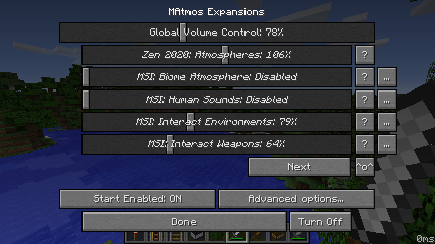

MAtmos
======

MAtmos is a sound atmosphere generator for Minecraft 1.12 and [1.7.10](https://github.com/makamys/MAtmos/tree/1_7_10). Originally created by Hurricaaane, it is now maintained by the community.

Whenever you join a multiplayer server or single-player world, MAtmos will search your surroundings and generates a soundscape of natural noises to match, filling out that perpetual silence of Minecraft.

#### What's new?
```
* New system for detecting when the player is outdoors, indoors, or deep indoors
* A new soundpack making use of the new features: Matmos 2020 "Zen"
* Update checking for sound packs which support it
* Versions are now built for Forge
* Many bug fixes and performance improvements
```

## Featured soundpacks
MAtmos lets you create your own soundscapes using special resource packs called **soundpacks**. Some of the ones that have been created are:


### MAtmos 2020 "Zen"
[](http://www.youtube.com/watch?v=3F85g3e2_MY "")

The flagship soundpack, featuring seamless loops and indoors/outdoors variations for ambiences. It aims to add high quality sounds that enhance the atmosphere without feeling out of place. (MAtmos 34 or higher required.)

**[(Website with downloads)](https://github.com/makamys/MAtmos-2020-Zen)**

*(by makamys)*

### Minecraft Sound Improvement

[](https://www.youtube.com/watch?v=OnUeix34Qc4)

The MSI expansion features a large variety of new sounds for every biome, striving to create a very unique atmosphere for each of them.

**[(Website with downloads)](https://github.com/makamys/MSI-Conversion)**

*(by [Colonel_Oneill](http://www.minecraftforum.net/members/Colonel_Oneill))*

### Default soundpack (+introduction)

[](http://www.youtube.com/watch?v=Z4Zu4kvyDHU "")

The original MAtmos soundpack from 2012, updated to work on the latest version.

**[(Website with downloads)](https://github.com/makamys/MAtmos-2016-Default)**

*(by Hurricaaane)*

## Usage
By default, MAtmos does not include any sounds. To get started, move the soundpacks you want to your resource packs folder an enable them.

Pressing F7 opens the MAtmos settings menu which can be used to adjust the volume levels of the individual expansions that make up soundpacks. You can even combine different expansions from different soundpacks! Customize your experience to exactly the way you like it.



## Suggested companion mods

[***Dynamic Surroundings***](https://www.curseforge.com/minecraft/mc-mods/dynamic-surroundings) for better footstep sounds. (Yes, it's compatible.) Disable its biome sounds in the config to only get the footsteps.

***[Sound Filters](https://www.curseforge.com/minecraft/mc-mods/sound-filters) / [Sound Physics](https://github.com/djpadbit/Sound-Physics) [(1.7.10 build here)](https://github.com/djpadbit/Sound-Physics/issues/26)*** for reverb and muffling of sounds behind walls.

## Troubleshooting

If adding MAtmos on 1.12.2 causes the game to **crash upon startup**, it's probably because you're using other, outdated mods that use version 0.7 of the Mixin library, while this mod uses version 0.8. This problem commonly occurs with old modpacks. There are 3 ways to resolve this:

a) Update the other mods of the modpack

b) Add the [Mixin Compatibility](https://www.curseforge.com/minecraft/mc-mods/mixin-0-7-0-8-compatibility) mod to your instance.

c) Use the versions of MAtmos ending in *-mixin0.7.jar* which are provided for compatibility.

## Downloads

Releases for **MAtmos** are available on [the releases tab](https://github.com/makamys/MAtmos/releases).

For **soundpack** downloads, see the *Featured soundpacks* section above.

Want even **more soundpacks**, or more info? See Sollace's old wiki: https://github.com/Sollace/MAtmos/wiki

## Contributing

The project uses Git submodules. Run `git submodule init` followed by `git submodule update` after checking out to fetch them.

The project can be built using Gradle.

The project uses a multi-project structure. The subproject for each game version can be found in `projects/<version>` folder. Some subprojects can be built with different targets, add `-Ptarget=foo` to your gradle command to target the `foo` target.

To run in an IDE, use the following program arguments:

`--tweakClass org.spongepowered.asm.launch.MixinTweaker --mixin haddon.mixin.json`

The project has a "roadmap" [here](https://github.com/makamys/MAtmos/wiki/Roadmap).

## Licenses

MAtmos itself is under WTFPLv2. Redistribute/Modify at will.

MAtmos source code requires some custom libraries/classes found at https://github.com/makamys/MC-Commons (WTFPLv2)

The (net.sf.) PracticalXML library (Apache License) is also required to compile versions that include the XML expansion converter:
- net.sf.practicalxml.*
